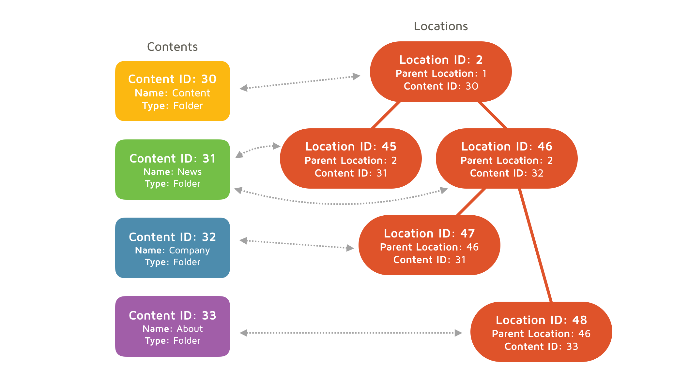

# eZ Platform Developer Trainining

<center><small>Created by <a href="http://ez.no">eZ Systems</a></small></center>

---

##AGENDA

--

## Structure of the training

- Learning the core concepts
- Building hands on basic site using
  - Build content structure
  - Create base template and embed static assets
  - Define page level templates
  - Create a Query Type for content listings
- Introduction to dynamic landing pages

---

## eZ Platform Core Concepts

- Content Types
- Content Objects
- Locations
- Access control

--

## Content Types




---

##What we already have

```
$ cd /var/www/html/advancedtraining
```

Bike Ride Website
```
Frontend: www.ezstudio.dev
Backend: www.ezstudio.dev/ez
Database: ezstudio

```

---

###<a target="_blank" href="ad01_multisiteaccesses.html">Multi-Siteaccess configuration</a>

---

###<a target="_blank" href="ad02_landingpages.html">Explore LandingPage management (EE)</a>

---

###<a target="_blank" href="ad03_youtubeblock.html">Create Custom LandingPage Block (EE)</a>

---

###<a target="_blank" href="ad04_fieldtype.html">Custom eZ Platform Field Type</a>

---

###<a target="_blank" href="ad05_form_builder.html">Form Builder (EE)</a>

---

###<a target="_blank" href="ad06_ui_extension.html">UI Extension</a>

---

###<a target="_blank" href="ad07_dashboardwidget.html">Dashboard Widget</a>

---

###<a target="_blank" href="ad08_repository_signals.html">Repository Signals</a>

---

###<a target="_blank" href="ad09_solrsearch.html">Solr and Search</a>

---

##END


info@ez.no
